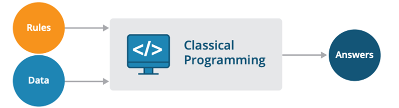
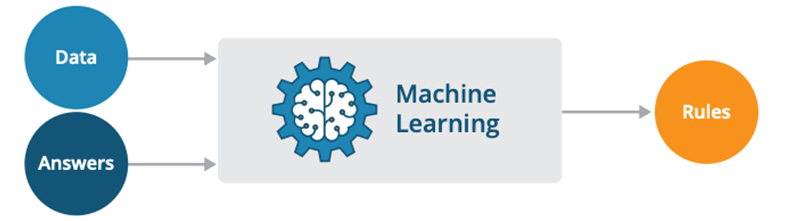
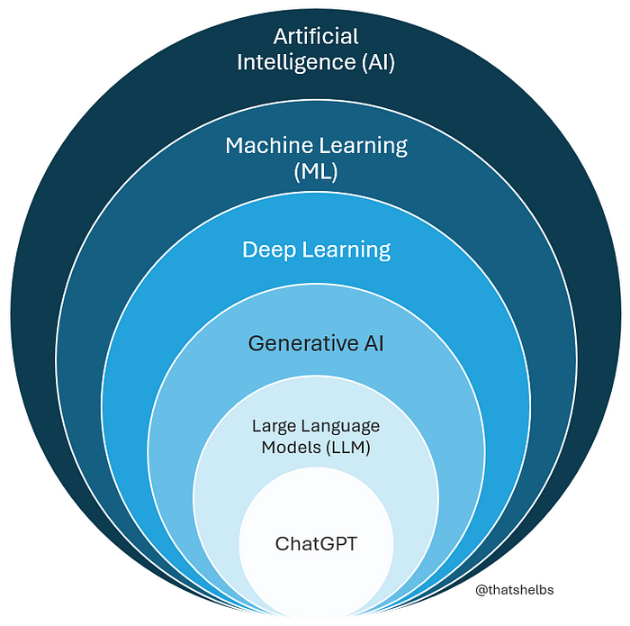
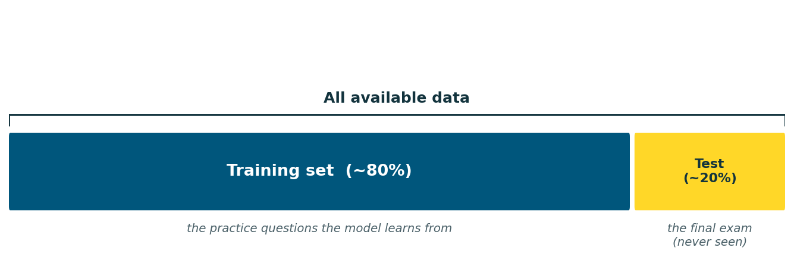

## You already used AI this morning {.smaller}

Think about the last few hours:

::: {.incremental}
- 📱 Your phone unlocked by **recognizing your face**
- ▶️ YouTube recommended a video you **actually watched**
- 💬 Maybe you asked ChatGPT to explain something
:::

. . .

All of that is **Artificial Intelligence** working behind the scenes.

::: {.big}
AI = the science of making machines smart.
:::

## The flip that changed everything {.smaller}

```{=html}
<div style="display:flex;gap:26px;align-items:flex-start;margin-top:6px"><div style="flex:1">
```
**Traditional programming**

{style="width:100%"}

`rules + data → answers`

You write the rules. The computer applies them to produce an answer.

```{=html}
</div><div style="flex:1">
```
**Machine learning flips it**

{style="width:100%"}

`data + answers → rules`

We show the computer examples. It figures out the rules itself.

```{=html}
</div></div>
```

::: {.sub}
The more relevant data it sees, the better it gets at spotting patterns and making predictions.
:::

## The AI family 🌳 {.smaller}

```{=html}
<div style="display:flex;gap:30px;align-items:center;margin-top:4px"><div style="flex:1.15">
```
AI is a big umbrella. Three terms you'll hear everywhere:

::: {.incremental}
- **Machine Learning (ML)**: computers learn from data without being explicitly programmed for every case
- **Deep Learning (DL)**: a specialized form of ML using neural networks with many layers. Powers image recognition, speech, language
- **Generative AI**: models that CREATE new content: text, images, music, code. ChatGPT is one
:::

::: {.sub}
Each one sits inside the previous: AI ⊃ ML ⊃ DL ⊃ Generative AI.
:::
```{=html}
</div><div style="flex:0.85"></div></div>
```

## Three ways machines learn {.smaller}

The student analogy makes them unforgettable:

| Paradigm | The analogy | Real example |
|---|---|---|
| **Supervised** | A student with a teacher and an **answer key**: problems with correct answers | Spam detection: emails labeled "spam" / "not spam" |
| **Unsupervised** | **No answer key**: problems only, find patterns yourself | Grouping customers by shopping behavior |
| **Reinforcement** | Learning a **video game**: try actions, get rewards or penalties, improve | Game-playing AI, robot control |

## {.smaller .quiz-slide}

[?]{.quiz-mark}

Your phone's photo app automatically groups pictures of the same person together, without you ever labeling anyone. Which type of learning? Why?

::: {.quiz-footer}
Pause & discuss with a partner
:::

# 📊 Datasets: the fuel {background-color="#eff6ff"}

## Features and labels {.smaller}

A **dataset** is a structured collection of data, think of a big spreadsheet:

::: {.incremental}
- **Features** = the input columns: measurable properties the model learns from
- **Label** = the target column: what the model tries to predict
:::

. . .

Set the features below and watch the price, and exactly how each feature contributed to it. 👇

<iframe src="widgets/house_price.html" style="width:100%;height:420px;border:0;overflow:hidden" scrolling="no"></iframe>

::: {.sub}
Later today, a model learns weights like these from data, instead of us setting them by hand.
:::

## The train/test split {.smaller}

A question: if you study using the **exact questions** that appear on the final exam, does a high grade prove you understood the material?

. . .

**No.** It proves you memorized those specific questions.

. . .

ML has the same problem, so we split every dataset:

{fig-align="center" height="300"}

## {.smaller .quiz-slide}

[?]{.quiz-mark}

A friend trains a model and proudly reports 99% accuracy, measured on the training data. Why should you be suspicious?

::: {.quiz-footer}
Pause & discuss with a partner
:::

# 📈 Regression {background-color="#ecfdf5"}

## Two flavors of supervised learning {.smaller}

Depends on what you're predicting:

::: {.incremental}
- **Regression** → predicting a **number** 🔢\
  [house price, tomorrow's temperature, calories burned in a workout]{.example-line}
- **Classification** → predicting a **category** 🏷️\
  [spam or not, cat or dog, edible or poisonous]{.example-line}
:::

. . .

::: {.big style="font-size:1em"}
Let's start with regression, the most famous line in machine learning.
:::

## Linear regression {.smaller}

Find the **best-fitting straight line** through the data, then use it to predict:

::: {.big style="font-size:1.2em"}
y = m·x + b
:::

::: {.incremental}
- **m** = the slope: how much y changes when x increases by 1
- **b** = the intercept: the value of y when x = 0
- **Training** = searching for the m and b that fit the data best
:::

. . .

::: {.sub}
If we learn *calories = 7.2 × minutes + 15*, we can predict a 60-minute workout burns ~447 calories, even though no 60-minute workout was in our data.
:::

## Be the algorithm {background-color="#fafafa"}

Drag **m** and **b** to fit the line. The red bars are your errors, make them shrink. Can you beat the machine? 👇

<iframe src="widgets/regress.html" style="width:100%;height:460px;border:0;overflow:hidden" scrolling="no"></iframe>

## What you were minimizing: MSE {.smaller}

Every point gets a prediction; the gap to the true value is the **error**.

$$MSE = \frac{1}{n}\sum_{i=1}^{n} (y_i - \hat{y}_i)^2$$

::: {.sub}
yᵢ = true value · ŷᵢ = prediction · n = number of points. Closer to zero = better.
:::

::: {.incremental}
- **Squaring punishes big mistakes brutally**: off by 10 costs 100. Off by 100 costs 10,000. 💥
:::

## {.smaller .quiz-slide}

[?]{.quiz-mark}

Why square the errors instead of just averaging them directly?

Hint: what happens if one error is +50 and another is −50?

::: {.quiz-footer}
Pause & discuss with a partner
:::

# 🏷️ Classification {background-color="#fdf4ff"}

## Predicting categories {.smaller}

Is this email spam? Is this tumor benign? Is this mushroom safe to eat? *(You'll answer that last one yourself in today's lab. 🍄)*

The classic algorithm: **Logistic Regression**, which, despite the confusing name, is a **classification** algorithm.

::: {.sub}
Despite the name, it does not predict a number. It predicts a category.
:::

## Scores → probabilities → decisions {.smaller}

The trick, in three steps:

::: {.incremental}
1. Compute a **score** z from the features (each feature × a learned weight, plus a bias)
2. Squeeze z through the **sigmoid function** → a **probability between 0 and 1**
3. Compare to a **threshold** (commonly 0.5):<br>
   probability ≥ 0.5 → class 1 ("spam") · below → class 0 ("not spam")
:::

Drag z below and watch step 2 happen live. 👇

<iframe src="widgets/sigmoid.html" style="width:100%;height:320px;border:0;overflow:hidden" scrolling="no"></iframe>

# ⚖️ How good is our model? {background-color="#fff7ed"}

## Not all mistakes are equal {.smaller}

Our model predicts. Some predictions are right, some wrong, and the four possible outcomes have names. Running example: spam detection, where "positive" = spam.

| | Actually spam | Actually NOT spam |
|---|---|---|
| **Model says: spam** | True Positive ✓ | **False Positive** ✗ : a real email lands in junk! |
| **Model says: not spam** | **False Negative** ✗ : spam reaches your inbox | True Negative ✓ |

## Accuracy can lie {.smaller}

**Accuracy** = correct predictions ÷ total predictions. Sounds perfect, right?

. . .

Imagine 1000 emails where only **10 are spam**.

A lazy model that predicts "not spam" for **everything**:

::: {.big style="font-size:1em"}
99% accuracy. Zero spam caught. 🤡
:::

. . .

That's why we need two sharper metrics:

::: {.incremental}
- **Precision**: of everything flagged as spam, how much really was? *(high = you can trust the flag)*
- **Recall**: of all the real spam out there, how much did we catch? *(high = little sneaks past)*
:::

## The four outcomes {.smaller}

A **confusion matrix**: rows = what actually happened, columns = what the model predicted.

```{=html}
<div style="margin-top:10px;font-size:0.78em"><div style="display:grid;grid-template-columns:34px 78px 1fr 1fr;grid-template-rows:28px 26px 1fr 1fr;gap:5px;height:400px"><div style="grid-column:1/3;grid-row:1/2"></div><div style="grid-column:3/5;grid-row:1/2;text-align:center;font-weight:800;color:#12333D;display:flex;align-items:center;justify-content:center;letter-spacing:.04em">PREDICTED</div><div style="grid-column:1/3;grid-row:2/3"></div><div style="grid-column:3/4;grid-row:2/3;text-align:center;font-weight:700;color:#4A6068;display:flex;align-items:center;justify-content:center">Positive</div><div style="grid-column:4/5;grid-row:2/3;text-align:center;font-weight:700;color:#4A6068;display:flex;align-items:center;justify-content:center">Negative</div><div style="grid-column:1/2;grid-row:3/5;writing-mode:vertical-rl;transform:rotate(180deg);display:flex;align-items:center;justify-content:center;font-weight:800;color:#12333D;letter-spacing:.04em">ACTUAL</div><div style="grid-column:2/3;grid-row:3/4;writing-mode:vertical-rl;transform:rotate(180deg);display:flex;align-items:center;justify-content:center;font-weight:700;color:#4A6068">Positive</div><div style="grid-column:3/4;grid-row:3/4;background:#D9F2E5;border:1px solid #9fd6b5;border-radius:10px;padding:12px;overflow:auto"><div style="font-weight:800;color:#0f6b3d;margin-bottom:4px">✅ True Positive (TP)</div><div style="color:#12333D">Model said SPAM. It really was spam. <b>Correct catch.</b></div></div><div style="grid-column:4/5;grid-row:3/4;background:#F8E1E0;border:1px solid #eab3af;border-radius:10px;padding:12px;overflow:auto"><div style="font-weight:800;color:#8a2f2c;margin-bottom:4px">❌ False Negative (FN)</div><div style="color:#12333D">Model said NOT spam. It really was spam. <b>A miss, slipped into the inbox.</b></div></div><div style="grid-column:2/3;grid-row:4/5;writing-mode:vertical-rl;transform:rotate(180deg);display:flex;align-items:center;justify-content:center;font-weight:700;color:#4A6068">Negative</div><div style="grid-column:3/4;grid-row:4/5;background:#F8E1E0;border:1px solid #eab3af;border-radius:10px;padding:12px;overflow:auto"><div style="font-weight:800;color:#8a2f2c;margin-bottom:4px">❌ False Positive (FP)</div><div style="color:#12333D">Model said SPAM. It was a real email. <b>False alarm.</b></div></div><div style="grid-column:4/5;grid-row:4/5;background:#D9F2E5;border:1px solid #9fd6b5;border-radius:10px;padding:12px;overflow:auto"><div style="font-weight:800;color:#0f6b3d;margin-bottom:4px">✅ True Negative (TN)</div><div style="color:#12333D">Model said NOT spam. It really was not spam. <b>Correct pass.</b></div></div></div></div>
```

::: {.sub}
**Precision** = TP / (TP + FP): the **predicted positive column**.<br>**Recall** = TP / (TP + FN): the **actual positive row**.
:::

## Three real decisions {.smaller}

```{=html}
<div style="display:flex;gap:16px;margin-top:6px">
```
```{=html}
<div style="flex:1;background:#F6F8F8;border:1px solid #E0E7E8;border-radius:12px;padding:16px"><div style="font-size:1.6em;margin-bottom:6px">🏥</div><div style="font-weight:800;color:#00567C;font-size:0.95em;margin-bottom:6px">Medical screening</div><div style="font-size:0.78em;color:#12333D;margin-bottom:10px">Could this patient have a serious disease?</div><div style="font-size:0.75em;color:#8a2f2c;margin-bottom:8px"><b>Worse mistake:</b> missing a sick patient (FN)</div><div style="display:inline-block;background:#1F8F89;color:#fff;font-weight:800;font-size:0.72em;padding:4px 10px;border-radius:999px;margin-bottom:10px">OBSESS OVER RECALL</div><div style="font-size:0.72em;color:#4A6068">A missed diagnosis can be fatal.</div></div>
```
```{=html}
<div style="flex:1;background:#F6F8F8;border:1px solid #E0E7E8;border-radius:12px;padding:16px"><div style="font-size:1.6em;margin-bottom:6px">📧</div><div style="font-weight:800;color:#00567C;font-size:0.95em;margin-bottom:6px">Spam filter</div><div style="font-size:0.78em;color:#12333D;margin-bottom:10px">Is this email spam?</div><div style="font-size:0.75em;color:#8a2f2c;margin-bottom:8px"><b>Worse mistake:</b> real email in junk (FP)</div><div style="display:inline-block;background:#00567C;color:#fff;font-weight:800;font-size:0.72em;padding:4px 10px;border-radius:999px;margin-bottom:10px">OBSESS OVER PRECISION</div><div style="font-size:0.72em;color:#4A6068">A missed spam email is a minor annoyance.</div></div>
```
```{=html}
<div style="flex:1;background:#F6F8F8;border:1px solid #E0E7E8;border-radius:12px;padding:16px"><div style="font-size:1.6em;margin-bottom:6px">⚖️</div><div style="font-weight:800;color:#00567C;font-size:0.95em;margin-bottom:6px">Criminal trial</div><div style="font-size:0.78em;color:#12333D;margin-bottom:10px">Is this person guilty?</div><div style="font-size:0.75em;color:#8a2f2c;margin-bottom:8px"><b>Worse mistake:</b> convicting an innocent person (FP)</div><div style="display:inline-block;background:#00567C;color:#fff;font-weight:800;font-size:0.72em;padding:4px 10px;border-radius:999px;margin-bottom:10px">OBSESS OVER PRECISION</div><div style="font-size:0.72em;color:#4A6068">"Better ten guilty go free than one innocent suffer."</div></div>
```
```{=html}
</div>
```

## Feel the tradeoff {background-color="#fafafa"}

Every email gets a score. YOU control the threshold. Drag it and watch precision fight recall, then switch mindsets. 👇

<iframe src="widgets/threshold.html" style="width:100%;height:560px;border:0;overflow:hidden" scrolling="no"></iframe>

## Which metric matters more? {.smaller}

It depends on **which mistake is more expensive**:

::: {.incremental}
- 🏥 **Medical screening**: missing a sick patient (FN) can be fatal → obsess over **recall**
- 📧 **Spam filtering**: your job offer in the junk folder (FP) is worse than seeing one spam → protect **precision**
:::

## {.smaller .quiz-slide}

[?]{.quiz-mark}

Today's lab: a model that decides whether a mushroom is edible or poisonous. 🍄

Which mistake is worse, calling a poisonous mushroom "edible," or calling an edible one "poisonous"? Which metric should you obsess over?

::: {.quiz-footer}
Pause & discuss with a partner
:::

# 🎭 Overfitting & Underfitting {background-color="#fef2f2"}

## Two students, two failures {.smaller}

The goal: perform well on data the model has **never seen**. Two things go wrong:

::: {.incremental}
- **Overfitting, the memorizer** 🧠📋<br>
  Memorizes every practice answer, including the noise and quirks. Aces the practice test, **collapses in the real exam**.<br>
  *Signs: excellent training performance, poor test performance.*
- **Underfitting, the skimmer** 😴<br>
  Too simple to capture the pattern at all. Does badly on the practice test **AND** the real exam.<br>
  *Signs: poor performance on both.*
:::

## Watch both happen {background-color="#fafafa"}

One slider controls how complex the model is. Slide from 1 (skimmer) to 9 (memorizer), and keep one eye on the **test error**. 👇

<iframe src="widgets/overfit.html" style="width:100%;height:470px;border:0;overflow:hidden" scrolling="no"></iframe>

## How do we fight overfitting? {.smaller}

::: {.incremental}
- **Get more data**: the more examples, the harder to memorize them all
- **Use a simpler model**: fewer opportunities to memorize noise
- **Always evaluate on a test set**: this is how overfitting gets *caught*
- **Regularization**: a penalty for complexity during training. For now: *"penalty for being too complicated"* is all you need
:::

## {.smaller .quiz-slide}

[?]{.quiz-mark}

Model A: 98% training accuracy, 65% test accuracy. Model B: 85% training accuracy, 83% test accuracy.

Which would you deploy, and what is Model A suffering from?

::: {.quiz-footer}
Pause & discuss with a partner
:::

# 🛠️ What you'll build {background-color="#f8fafc"}

## Three labs {.smaller}

::: {.incremental}
- **Lab 0: Data Explorer Warm-up** 🐍<br>
  Meet Python's pandas library on a Pokémon dataset: loading, filtering, sorting, basic stats. Every ML project starts with understanding the data.
- **Lab 1: Calorie Predictor** 🔥<br>
  Build and train a linear regression model on workout data, then use it to predict calories for a workout of your own.
- **Lab 2: Mushroom Survival** 🍄<br>
  Train a logistic regression classifier on real mushroom features, then evaluate it with the metrics from today, precision, recall, and the honest question of which mistake it's making.
:::

. . .

::: {.big}
Data + answers → rules. Let's go find some rules. 🚀
:::
