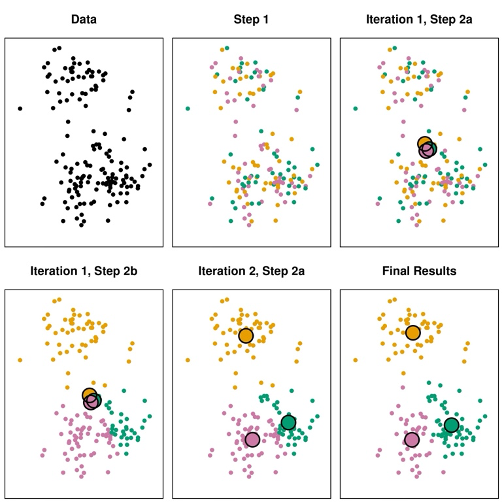
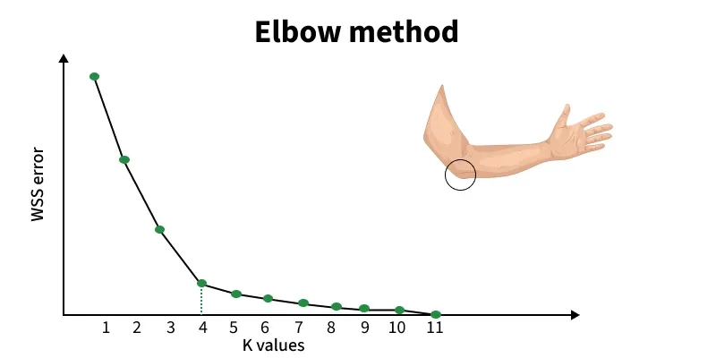
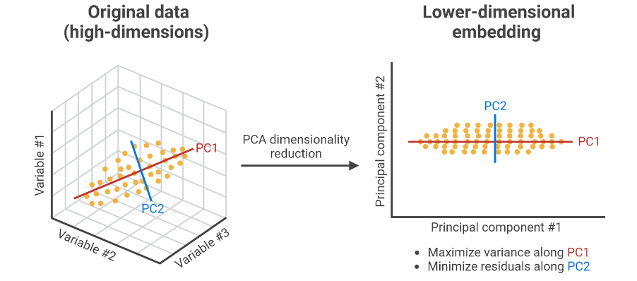

## Every model so far had a teacher {.smaller}

Every dataset came with a **label**:

::: {.incremental}
- this email **IS** spam
- this mushroom **IS** poisonous
- this workout burned **THIS MANY** calories
:::

. . .

The model was a student with an answer key.

::: {.big}
Today we take the answer key away. 🗝️❌
:::

## Unsupervised learning {.smaller}

::: {.big style="font-size:1em"}
Machine learning on data with **no labels**.
:::

The model receives only the inputs, and has one job:

> *Find the hidden structure by itself.*

::: {.incremental}
- Which points are **similar**?
- Which points are **strange**?
- What **natural groups** exist?
:::

## Why would anyone want this? {.smaller}

::: {.icon-bullets}
**Most of the world's data is unlabeled**\
Nobody attaches a label to every click, purchase, sensor reading, or photo.

**Labeling costs money and time**\
Imagine paying doctors to label a million X-ray images one by one.

**Sometimes the categories are the question**\
A mall doesn't know in advance how many "types" of customers it has , that's exactly what it wants answered.
:::

## Supervised vs. Unsupervised {.smaller}

::: {.compare-two}
::: {.compare-col .light}
**SUPERVISED**

Data: features + labels

Goal: predict the label for new data

Like studying with an answer key

*e.g. "Is this email spam?"*
:::

::: {.compare-col .dark}
**UNSUPERVISED**

Data: features only

Goal: discover hidden structure

Like solving a puzzle with no picture on the box

*e.g. "What groups exist in my customers?"*
:::
:::

## {.smaller .quiz-slide}

[?]{.quiz-mark}

A hospital has 10,000 patient records with symptoms but no diagnoses. Grouping them into natural clusters , supervised or unsupervised?

What changes if the records already had diagnoses, and the goal was predicting a new patient's?

::: {.quiz-footer}
Pause & discuss with a partner
:::

# 🧩 Clustering {background-color="#ecfdf5"}

## What is clustering? {.smaller}

::: {.incremental}
- **Grouping points so similar ones sit together**: points in the same cluster resemble each other; points in different clusters don't
- **You already do this every day**: organizing a closet by clothing type, playlists by mood, contacts into family / friends / work
- **Algorithms do the same thing at scale**: thousands of data points, with "similar" defined mathematically , usually distance
:::

## Clustering in the wild {.smaller}

::: {.incremental}
- **Customer segmentation**: stores group shoppers by behavior and treat each group differently
- **Anomaly detection**: banks catch fraud because it doesn't fit in ANY cluster 🚨
- **Photo organization**: your phone groups the same face together without knowing anyone's name
- **Image compression**: grouping similar pixel colors together 🎨
:::

. . .

::: {.sub}
Two of these are literally today's labs.
:::

# 🎯 K-Means {background-color="#eff6ff"}

## The most famous clustering algorithm {.smaller}

**K-Means** groups data into **K clusters** (you choose K). Each cluster is defined by its **centroid**: the center point.

The algorithm is beautifully simple:

::: {.incremental}
1. **Choose K**: how many clusters you want
2. **Drop K random centroids** onto the data
3. **Assign**: every point joins its NEAREST centroid
4. **Update**: move each centroid to the average of its members
5. **Repeat** 3–4 until the centroids stop moving. Done! ✅
:::

## The pizza-branch analogy 🍕 {.smaller}

Opening K pizza branches in a city:

::: {.incremental}
- place them **randomly**
- every customer goes to their **nearest branch**
- relocate each branch to the **middle of its own customers**
- repeat until the locations settle
:::

. . .

::: {.big style="font-size:1em"}
That's the whole algorithm. Here it is frozen in six frames 👇
:::

## K-Means, Step by Step {.smaller}

{fig-align="center" height="520"}

::: {.sub}
Watch the big circles (centroids) drift toward the true group centers, dragging the colors with them.
:::

## Now run it yourself {background-color="#fafafa"}

Drive the algorithm by hand: drop centroids, assign, update , or press Auto-run. Watch the arrows when centroids move. 👇

<iframe src="widgets/kmeans.html" style="width:100%;height:480px;border:0;overflow:hidden" scrolling="no"></iframe>

## The big question: how do we choose K? {.smaller}

::: {.incremental}
- Pick **K = 2** for data with 5 natural groups → you **squash** different groups together
- Pick **K = 20** → you **shatter** real groups into fragments
- The data doesn't come with the answer… so we measure our way to it
:::

. . .

::: {.big style="font-size:1em"}
The most popular tool: the **Elbow Method** 💪
:::

## The elbow method {.smaller}

::: {.incremental}
1. Run K-Means with K = 1, 2, 3, … 10
2. For each K, measure how **tight** the clusters are , the total distance from points to their centroids. That score is called **inertia**, also written **WSS** (within-cluster sum of squares) , lower = tighter
3. Plot K against inertia: the curve drops fast, then **flattens**
4. The **elbow**: the bend where improvement suddenly slows , is your best K
:::

{fig-align="center" height="280"}

## Find the elbow yourself {background-color="#fafafa"}

This data secretly has some number of natural groups. Try each K and build the plot , where's the bend? 👇

<iframe src="widgets/elbow.html" style="width:100%;height:520px;border:0;overflow:hidden" scrolling="no"></iframe>

## {.smaller .quiz-slide}

[?]{.quiz-mark}

Your elbow plot keeps dropping smoothly with no visible bend anywhere.

What might that tell you about your data?

::: {.quiz-footer}
Pause & discuss with a partner
:::

## Key Terms {.smaller}

::: {.terms-list}
Centroid
: The center point of a cluster , K-Means moves it to the average position of its group after every round.

Inertia
: The total distance from points to their own centroid. Lower means tighter, more compact clusters.

Elbow Method
: Plotting K against inertia and picking the bend where improvement suddenly slows down.
:::

## Where K-Means Struggles {.smaller}

::: {.incremental}
- **You must choose K in advance**: even when you have no idea how many groups exist
- **It assumes clusters are round blobs**: curved or strange shapes, like two crescent moons, get sliced straight through
- **Every point MUST join a cluster**: no concept of "belongs to nothing." Outliers get forced in, and can even drag a centroid out of position
:::

. . .

::: {.big style="font-size:1em"}
These three weaknesses are exactly why our next algorithm exists.
:::

# 🌐 DBSCAN {background-color="#fdf4ff"}

## A completely different idea {.smaller}

**DBSCAN** takes a different view of what a cluster even is:

> *"A cluster is a **CROWDED region**. Wherever points are packed densely together , that's a cluster, whatever its shape. Points sitting alone in empty space belong to nothing: they are **noise**."*

. . .

The party analogy 🎉: friends stand close together in dense circles , each crowd is a cluster. Someone standing alone in the corner isn't forced into any group. They're simply labeled an outlier.

## No K required {.smaller}

Instead of choosing K, DBSCAN asks two simpler questions:

::: {.incremental}
- 📏 How close must two points be to count as **neighbors**?
- 👥 How many neighbors make a **"crowd"**?
:::

. . .

From those two settings, it discovers the number of clusters **by itself**: and fixes all three K-Means weaknesses at once.

## The showdown 🥊 {background-color="#fafafa"}

Same data, both algorithms. Switch datasets, drag the eps slider, and watch who wins where. 👇

<iframe src="widgets/dbscan.html" style="width:100%;height:560px;border:0;overflow:hidden" scrolling="no"></iframe>

## Head to head {.smaller}

|  | K-Means | DBSCAN |
|---|---|---|
| Number of clusters | You choose K in advance | **Discovered automatically** |
| Cluster shapes | Round blobs only | **Any shape** |
| Outliers | Forced into the nearest cluster | **Labeled as noise**, left out |
| Main settings | K | Neighbor distance + min crowd size |
| Weakness | Strange shapes, outliers | Clusters with very **different densities** |

## {.smaller .quiz-slide}

[?]{.quiz-mark}

A bank wants to detect fraud: transactions unlike everything else.

One algorithm forces every point into a cluster; the other labels lonely points as "noise." Which is the natural choice , and why?

::: {.quiz-footer}
Pause & discuss with a partner
:::

# 📉 Too many columns! {background-color="#fffbeb"}

## Too Many Columns? {.smaller}

::: {.incremental}
- **Real datasets often have hundreds of features**: humans can't plot or visualize more than 2 to 3 dimensions at once
- **Many features are redundant**: height in centimeters and height in inches carry the same information twice
- **PCA compresses what matters**: it finds the directions the data varies most, and keeps only those , like photographing a 3D object from its best angle
:::

## PCA in one sentence {.smaller}

**PCA** finds the directions where the data varies the most , and keeps only those.

> *"Squeeze 500 columns into 2 you can actually plot, losing as little information as possible."*

{fig-align="center" height="330"}

::: {.sub}
Like photographing a 3D object: you lose a dimension, but a well-chosen angle keeps everything recognizable. 📷
:::

## Key Takeaways {.smaller}

::: {.checklist}
Unsupervised learning finds structure with no labels , use it when labels are rare, costly, or unknown.

K-Means is fast and simple, but you must choose K and it assumes round, evenly-sized clusters.

DBSCAN finds clusters of any shape and flags outliers as noise , great for fraud and anomaly detection.

PCA compresses many features into a few, so you can actually see and work with your data.
:::

# 🛠️ What you'll build {background-color="#f8fafc"}

## Three labs, three views of one idea {.smaller}

::: {.incremental}
- **Lab 1 . The Mall Detective** 🕵️ 
  Segment 200 mall customers by income and spending, use the elbow method to discover how many customer "types" exist, and give each segment a marketing name.
- **Lab 2 . The Pixel Artist** 🎨 
  Use clustering to repaint YOUR own photos with only 2, 4, 8, or 16 colors , image compression, live.
- **Lab 3 . The Showdown** 🥊 
  K-Means vs DBSCAN head-to-head on tricky shapes , exactly the widget you just played with, but now YOU write it.
:::

. . .

::: {.big}
No answer key. Let's find the structure anyway. 🧩
:::
