## Machines that see are already everywhere {.smaller}

::: {.incremental}
- 📱 Your phone unlocks by **recognizing your face**
- 📷 Your camera draws a box around **every face** before you shoot
- 🚗 Self-driving cars **read traffic lights** and spot pedestrians
- 🏥 Hospital software finds tumours in scans **radiologists can miss**
:::

. . .

::: {.big style="font-size:1em"}
**Computer Vision** = giving computers eyes *and* a brain to interpret what they see.
:::

## You do this effortlessly {.smaller}

Look at a photo of your friend. Instantly you recognize their face, their clothes, the objects around them , even their mood.

Your brain does all of that in **milliseconds**, without you noticing any work.

. . .

Today's question: **how do we teach a machine to do the same?**

::: {.sub}
And the answer will change how you see every camera around you.
:::

## Why it matters {.smaller}

Computer vision is revolutionizing how we:

::: {.incremental}
- **Stay safe**: monitoring dangerous areas, detecting accidents
- **Stay healthy**: medical imaging, early disease detection
- **Stay connected**: photo tagging, video-call filters
- **Stay mobile**: self-driving cars, navigation
:::

## But humans and computers see very differently {.smaller}

::: {.img-split}
::: {.img-split-col}
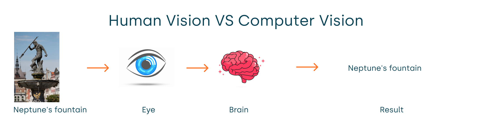

::: {.split-box .light}
**HUMANS**

- See colors, shapes, objects **instantly**
- Recognize faces, emotions, context
- Process everything in milliseconds
- Answer: *"Neptune's fountain."*
:::
:::

::: {.img-split-col}
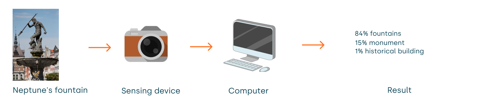

::: {.split-box .dark}
**COMPUTERS**

- See **numbers**: pixels with values
- Must be **taught** what patterns mean
- Process **step by step** through algorithms
- Answer: *"84% fountain, 15% monument…"*
:::
:::
:::

# 📷 What is a digital image? {background-color="#eff6ff"}

## A grid of tiny squares {.smaller}

A digital image is a giant grid of **pixels**. Each pixel has:

::: {.incremental}
- a **location**: row and column
- a **value**: how bright it is, from **0 (black) to 255 (white)**
- color images: **three** values per pixel . Red, Green, Blue
:::

## See it yourself {background-color="#fafafa"}

::: {.sub style="text-align:left;margin:0 0 .3em"}
Pick an image, walk through the three views, and hover the pixels in view 2. 👇
:::

<iframe src="widgets/pixels.html" style="width:100%;height:650px;border:0;overflow:hidden" scrolling="no"></iframe>

## The size of the problem {.smaller}

That was a tiny 24×24 grid . **576 numbers**: and you could still recognize Lincoln.

. . .

Now do the math on a *small* real photo:

::: {.big style="font-size:1.1em"}
224 × 224 pixels × 3 colors ≈ **150,000 numbers**
:::

::: {.sub}
Earlier models had a handful of feature columns. An image is a dataset with **150,000 columns** for ONE example.
:::

## From pixels to meaning {.smaller}

How do *you* read? &nbsp; **letters → words → sentences → meaning**

How must a computer see?

::: {.big style="font-size:1em"}
pixels → edges → shapes → objects → meaning
:::

::: {.sub}
Hold onto this ladder. The whole day climbs it.
:::

# 🎓 Training a model to see {background-color="#f0fdf4"}

## Like teaching a child {.smaller}

You don't explain what a cat *is* , you show examples:

::: {.incremental}
1. Feed thousands of cat images labelled **"cat"**
2. Feed thousands of dog images labelled **"dog"**
3. The algorithm finds the patterns that separate them
4. Show it a **new** image , it classifies cat vs dog
:::

. . .

::: {.sub}
Same story as always: features, labels, train/test split. The features just got much bigger.
:::

## Not all training data is equal {.smaller}

::: {.compare-two}
::: {.compare-col .light}
**GOOD TRAINING DATA ✅**

Thousands or millions of images

**Diverse** examples

Accurate labels

**Balanced**: equal amounts per category
:::

::: {.compare-col .dark}
**POOR TRAINING DATA ❌**

Too few images

All photos look similar

Wrong labels

1000 cats, 10 dogs
:::
:::

## {.smaller .quiz-slide}

[?]{.quiz-mark}

A team trains a "shark detector" only on photos of sharks near the surface in sunlight. It fails on deep-water sharks.

Which of the four rules did they violate?

::: {.quiz-footer}
Pause & discuss with a partner
:::

## Why the old tools break here {.smaller}

Try building a cat classifier with a plain neural network:

::: {.incremental}
- **150,000 feature columns** per image 🤯
- The SAME cat can be left or right, near or far, in sun or shadow . **the raw numbers change completely**, but the cat is still a cat
- Manual rules? *"Pointy ears"* , some dogs have them. *"Whiskers"* , define a whisker as pixel values. Good luck. 😅
:::

. . .

::: {.big style="font-size:0.95em"}
For decades engineers hand-crafted image features. Progress was slow. 
The breakthrough: models that **learn the features themselves, from raw pixels.**
:::

::: {.sub}
Welcome to **Deep Learning**.
:::

# 🧠 Deep Learning {background-color="#fdf4ff"}

## Neural networks in 60 seconds {.smaller}

Loosely inspired by the brain. The building blocks:

::: {.incremental}
- **A neuron** takes input numbers, multiplies each by a **weight** (its importance), sums them, and an **activation function** decides how strongly it "fires"
- **A layer** = many neurons working in parallel on the same inputs
- **A network** = stacked layers; each layer's output feeds the next
- **"Deep"** just means *many layers*
:::

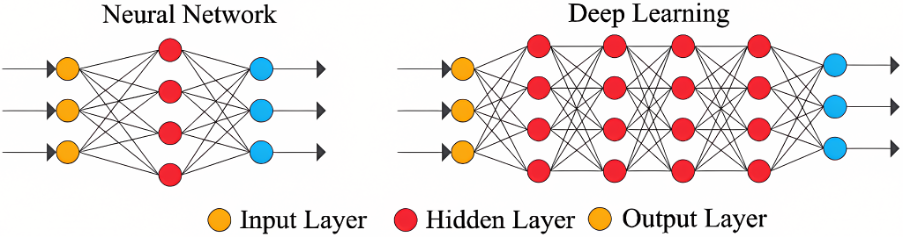{fig-align="center" height="260"}

## How does it learn? The same story, bigger {.smaller}

::: {.incremental}
1. The network makes a prediction
2. A **loss function** measures how wrong it was
3. Every weight gets nudged a tiny bit to reduce the error , that's **backpropagation**
4. Repeat **millions** of times
:::

. . .

::: {.big style="font-size:0.95em"}
The network literally learns from its mistakes.
:::

::: {.sub}
Same loss-and-weights loop from before, at a much bigger scale.
:::

## Each layer climbs one rung {.smaller}

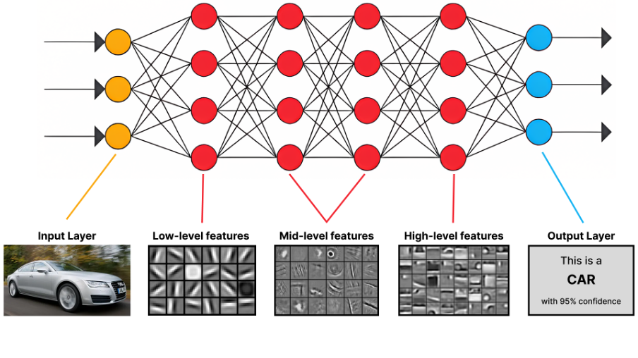{fig-align="center" height="330"}

::: {.incremental}
- **Layer 1**: *"I see horizontal and vertical lines"* (edges, corners)
- **Layers 2–3**: *"these lines form circles and rectangles"* (shapes, textures)
- **Deeper layers**: *"this circle with spokes looks like a wheel!"* (object parts)
- **Output layer**: *"it's a car . 95% confident"*
:::

::: {.sub}
These are real filters from a trained network. Nobody programmed them , it **invented** every one during training.
:::

# 🔍 CNNs: the image specialist {background-color="#fff7ed"}

## One brilliant idea {.smaller}

A plain neural network treats all 150,000 pixels as **independent** inputs , it doesn't know neighbouring pixels are related.

. . .

The **Convolutional Neural Network (CNN)** fixes this:

::: {.big style="font-size:1.05em"}
Look at the image through **small sliding windows.** 🔍
:::

::: {.sub}
A cat's ear is a *local* pattern. You find it by scanning, not by staring at all 150,000 numbers at once.
:::

## The window is called a kernel {.smaller}

A **kernel** (or filter) is a tiny grid of weights , typically 3×3. It **slides** across the image; at every stop it multiplies its weights with the pixels underneath and sums the result.

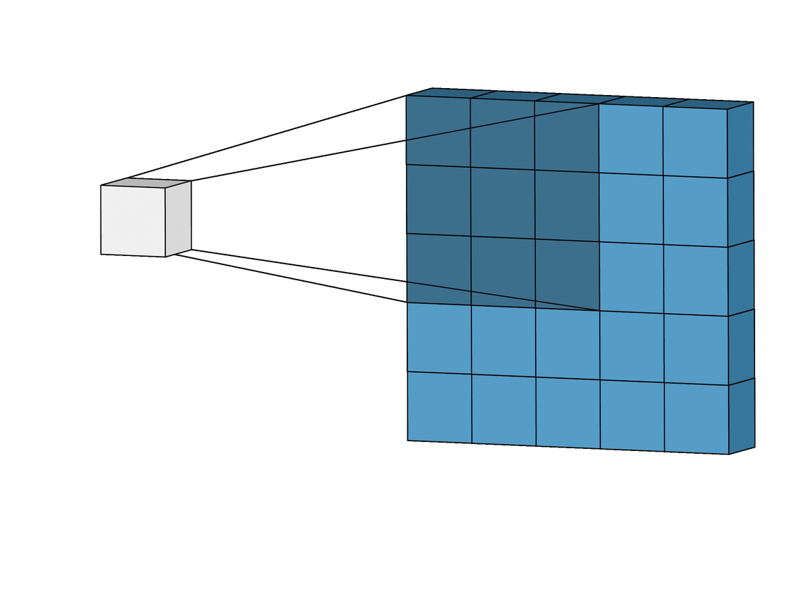{fig-align="center" height="330"}

::: {.sub}
The output is a **feature map**: a new "image" showing WHERE the kernel's pattern was found.
:::

## Stride , how far the window jumps {.smaller}

**Stride** = how many pixels the window jumps between stops.

::: {.gif-two}
::: {.gif-col}
**Stride = 1**

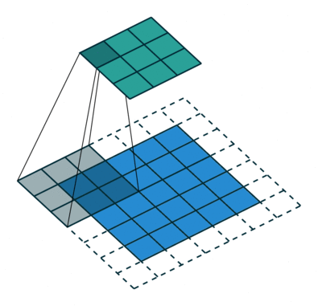

[Visits every position. Output stays close to the input size.]{.cap}
:::

::: {.gif-col}
**Stride = 2**

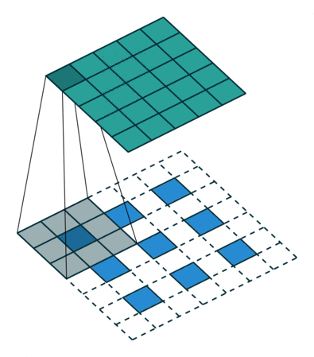

[Skips every other position. Output comes out **half the size**.]{.cap}
:::
:::

## Padding {.smaller}

**Padding** adds a border of zeros so the kernel can also visit the edges.

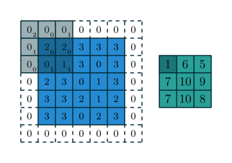{fig-align="center" height="300"}

::: {.sub}
Keeps the output the same size · prevents shrinking after many layers · catches features at the borders
:::

## The arithmetic, in 3D {.smaller}

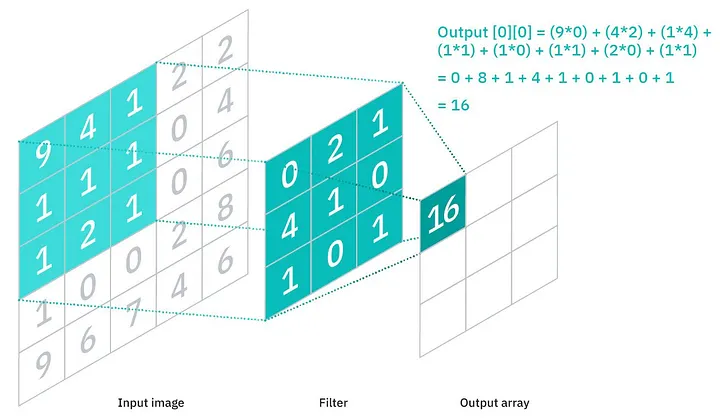{fig-align="center" height="420"}

::: {.sub}
Every stop is the same sum: multiply each kernel weight by the pixel underneath, add them all up, write **one number** into the feature map.
:::

## Convolution, live {background-color="#fafafa"}

::: {.sub style="text-align:left;margin:0 0 .3em"}
Pick a kernel, press Play, then flip **stride** and **padding** and watch the output size change. 👇
:::

<iframe src="widgets/kernel.html" style="width:100%;height:660px;border:0;overflow:hidden" scrolling="no"></iframe>

## Now on a REAL photo {background-color="#fafafa"}

Same math , now on a real photo. Press **Walk** and follow the yellow box: it visits every pixel, and the feature map on the right fills in behind it. 👇

<iframe src="widgets/conv_image.html" style="width:100%;height:600px;border:0;overflow:hidden" scrolling="no"></iframe>

## The key point {.smaller}

We just *chose* kernels by hand: blur, sharpen, edge…

. . .

::: {.big}
A CNN **invents its own kernels** during training.
:::

::: {.incremental}
- Training nudges the kernel weights, exactly like every other weight
- The network discovers *which* patterns matter for its task
- Fur texture? Ear curves? Whisker lines? **It decides**: not us
:::

## Learned filters scanning a real dog {.smaller}

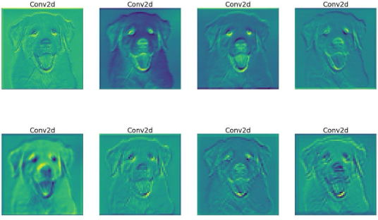{fig-align="center" height="440"}

::: {.sub}
Each map answers one question: *"where is MY pattern?"* Bright = found it.
:::

## Stack layers , patterns of patterns {background-color="#fafafa"}

One layer finds edges. What happens when the next layer scans **the feature maps**? Try it: click a map, feed it deeper. 👇

<iframe src="widgets/features.html" style="width:100%;height:560px;border:0;overflow:hidden" scrolling="no"></iframe>

## Pooling: zoom out, keep the highlights {.smaller}

**Pooling** shrinks feature maps by summarising each 2×2 block into a single number. Two ways to summarise:

::: {.gif-two .tight}
::: {.gif-col}
**Max pooling**

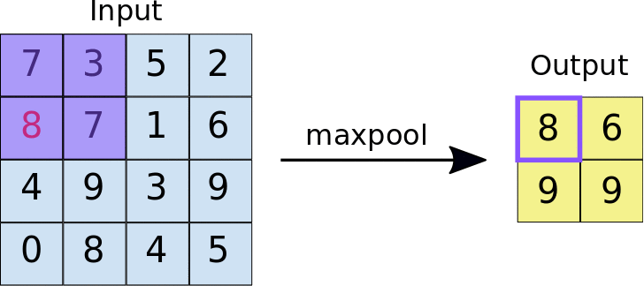

[Keeps the **strongest** value in each block: *"was the pattern found here at all?"* The usual default.]{.cap}
:::

::: {.gif-col}
**Average pooling**

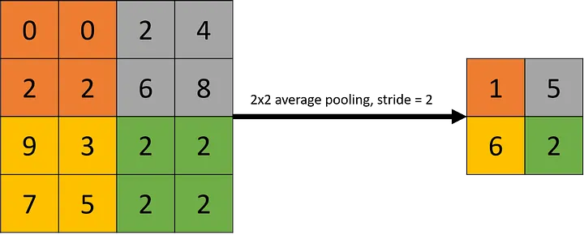

[Keeps the **mean** of each block: a smoother, gentler summary that dilutes a lone strong hit.]{.cap}
:::
:::

::: {.incremental}
- Either way, feature maps get smaller → the network gets **faster**
- More important: it gets **more tolerant**: if the cat shifts a few pixels, the pooled map barely changes
:::

## {.smaller .quiz-slide}

[?]{.quiz-mark}

After one 2×2 max-pool, a 28×28 feature map becomes what size?

And why do we keep the MAX rather than the average? (Think: "was the pattern found HERE , yes or no?")

::: {.quiz-footer}
Pause & discuss with a partner
:::

## The full CNN recipe {.smaller}

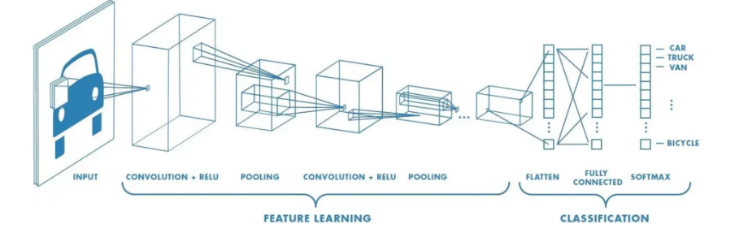{fig-align="center" height="340"}

::: {.incremental}
- **Convolution** layers detect patterns , deeper = more abstract
- **Pooling** layers shrink maps, keep the strongest signals
- Repeat conv + pool a few times
- **Flatten** into one long vector
- **Dense** layers make the call: *"cat: 92%, dog: 8%"*
:::

# 🏋️ Transfer Learning {background-color="#f0f9ff"}

## The problem with training from scratch {.smaller}

Training a good CNN from zero needs:

::: {.incremental}
- **Millions** of labelled images
- Serious GPU power, for days or weeks
- …and you don't have either right now 😅
:::

. . .

::: {.big style="font-size:1em"}
Here's the trick the whole industry uses: **don't start from scratch.**
:::

## Standing on the shoulders of giants {.smaller}

Models like **ResNet** were already trained on **ImageNet**: over a million images, 1,000 categories.

Their early layers learned **universal visual skills**: edges, textures, shapes, animal parts. Useful for almost ANY image task.

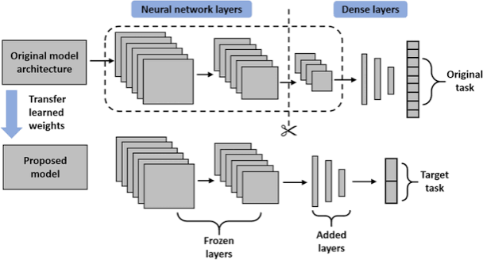{fig-align="center" height="300"}

## The recipe {.smaller}

::: {.incremental}
1. **Take a pretrained network**: keep ("freeze" 🔒) its layers: the visual skills
2. **Chop off the final decision layer**: the 1,000-class ImageNet part
3. **Attach a small new head** for YOUR task , and train ONLY that
:::

## Why not just start from scratch? 🎙️ {.smaller}

You have a speech model trained on **American English**. You want it to handle a **British accent**.

::: {.incremental}
- **From scratch**: the new model must relearn what a vowel is, what a consonant is, where words end, what English grammar looks like… **thousands of hours of audio**, all to rediscover things the first model already knew
- **Transfer learning**: the pretrained model *already knows English*. Sounds, letters, words, grammar , all of it
- Only the **last part** needs to change: how those known sounds map onto a different pronunciation
- So you freeze everything it already knows, retrain only the final layer, and it adapts with **a few hours** of British audio
:::

. . .

::: {.big style="font-size:0.95em"}
Same for vision: edges, textures and shapes are the same in every image. Only the final *"which class is this?"* decision is yours to teach.
:::

## Feel the difference {background-color="#fafafa"}

::: {.sub style="text-align:left;margin:0 0 .3em"}
Walk it through: meet the giant, copy it, chop the head, bring your photos, and watch it train. 👇
:::

<iframe src="widgets/transfer.html" style="width:100%;height:640px;border:0;overflow:hidden" scrolling="no"></iframe>

# 🎨 Data Augmentation {background-color="#fefce8"}

## Small dataset? Multiply it. {background-color="#fafafa"}

**Data augmentation** creates modified copies of your training images: flipped, rotated, zoomed, brightened.
A cat flipped left-to-right is still a cat , but to the network it's a **fresh example**. Free data! 🎁

Play with it: every setting you land on is a "new" training image. 👇

<iframe src="widgets/augment.html" style="width:100%;height:470px;border:0;overflow:hidden" scrolling="no"></iframe>

## Why it works {.smaller}

The network sees more **variety**, so it learns *"cat-ness"* instead of memorizing the exact photos.

. . .

Sound familiar? That's the **overfitting** medicine, applied to images.

Here's what it looks like on real training curves 👇

## Spot the sickness {.smaller}

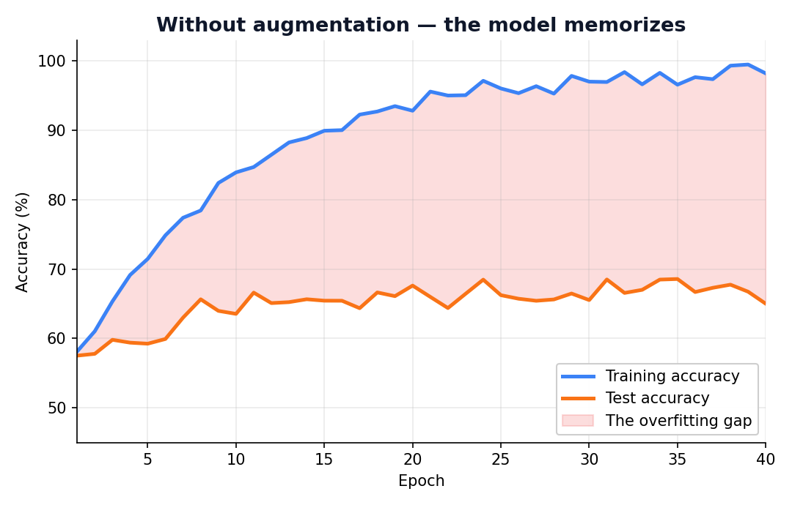{fig-align="center" height="480"}

::: {.sub}
Training accuracy soars to ~98%… test accuracy stalls at ~65%. That red area is the model **memorizing**.
:::

## Same model + augmentation {.smaller}

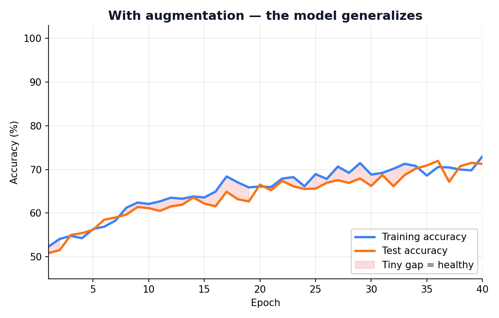{fig-align="center" height="480"}

::: {.sub}
The two curves braid together , a tiny gap. It learned *cats*, not *these exact photos*.
:::

## But augmentation has teeth {.smaller}

Not every transformation is safe , it depends on **what the label means**.

::: {.incremental}
- 🔄 **Flipping a chest X-ray**: the heart is on the *left*. Mirror it and you've invented a rare condition, still labelled "normal"
- 🔄 **Flipping text or a licence plate**: "STOP" becomes meaningless. Any OCR label is now a lie
- ↩️ **Rotating a road sign**: a rotated arrow points somewhere else entirely. "Turn left" is now "turn down"
- 🎨 **Recoloring fruit**: brightness and contrast are fine, but shifting hue turns a healthy green apple into a red one , and if your task is *"is this fruit ripe?"*, you just corrupted the label
- 🔍 **Aggressive zoom on a tumour scan**: crop too hard and the tumour leaves the frame, but the image is still labelled "tumour"
:::

. . .

::: {.big style="font-size:0.95em"}
The rule: an augmentation is safe only if the **label is still true afterwards**.
:::

## {.smaller .quiz-slide}

[?]{.quiz-mark}

You have 500 falcon photos, and in ALL of them the falcon faces right. The model fails badly on falcons facing left.

Which augmentation fixes this, and can you think of a kind of image where that SAME augmentation would be a terrible idea?

::: {.quiz-footer}
Pause & discuss with a partner
:::

# 🦁 The task zoo {background-color="#f8fafc"}

## Classification . WHAT is in the image? {.smaller}

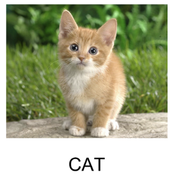{fig-align="center" height="420"}

## Detection , what and WHERE? {.smaller}

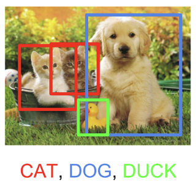{fig-align="center" height="420"}

::: {.sub}
Multiple objects, each with a box. This is what self-driving cars run, dozens of times per second.
:::

## Segmentation , which exact PIXELS? {.smaller}

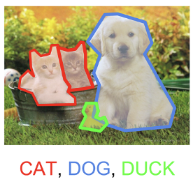{fig-align="center" height="420"}

::: {.sub}
Same scene, three levels of precision: a label → a box → an outline, pixel by pixel.
:::

## Face recognition , WHO is this? {.smaller}

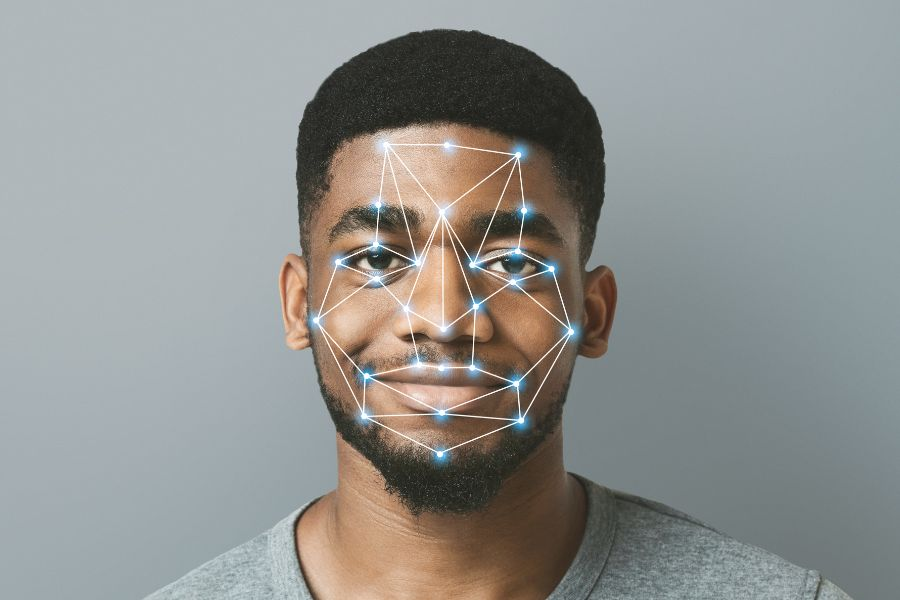{fig-align="center" height="400"}

::: {.sub}
Detection finds *a face*. Recognition goes further: it maps the geometry into a numeric fingerprint and asks **which person** it belongs to. This is your phone's unlock.
:::

## OCR , what does the TEXT say? {.smaller}

{fig-align="center" height="380"}

::: {.sub}
Find the text, then read it character by character: scanned documents, receipts, licence plates.
:::

## All the same foundations {.smaller}

::: {.big style="font-size:1.05em"}
pixels → kernels → feature maps → decisions
:::

::: {.sub}
Every task in this zoo is built on what you learned today. Only the final layer changes.
:::

## What you'll build {.smaller}

::: {.incremental}
- **Lab 1 . The Filter Factory** 🏭 Load YOUR photo and manipulate it like a pro: crop with array slicing, grayscale, blur, run edge detection by hand.
- **Lab 2 . Build Your First CNN** 🧱 The conv → pool → dense recipe in real PyTorch, trained on cats vs dogs.
- **Lab 2.5 . The Digit Recognizer** ✍️ Train a CNN to read handwritten digits , then draw your own and test it.
- **Lab 3 . Stand on the Shoulders of Giants** 🏔️ A pretrained ResNet18: first let it guess your photo from 1,000 categories, then freeze it and retrain the head.
:::

. . .

::: {.big}
Let's teach some machines to see. 👁️
:::
