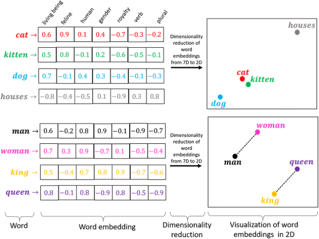
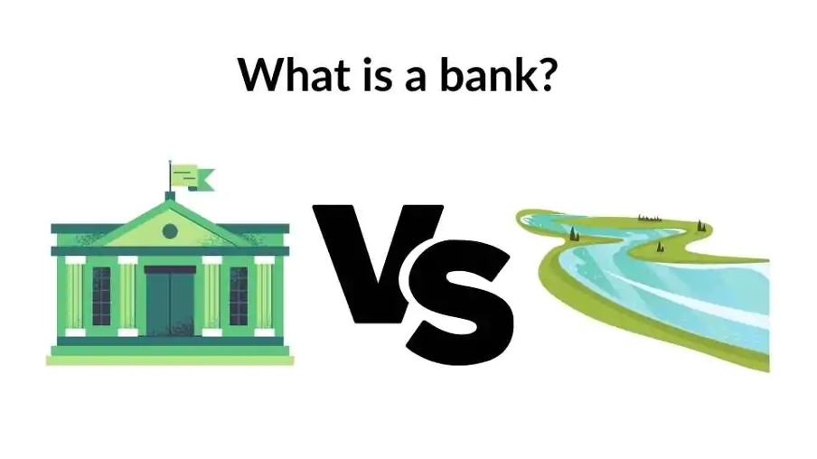
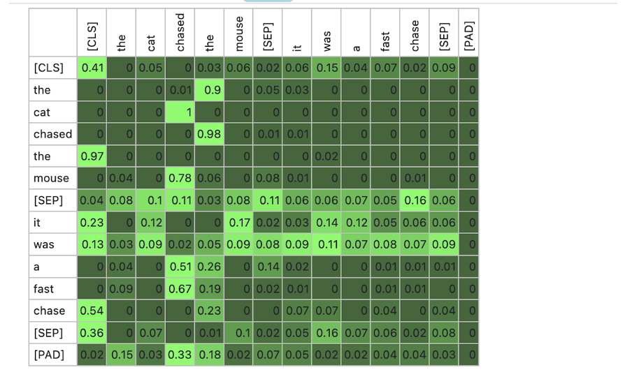
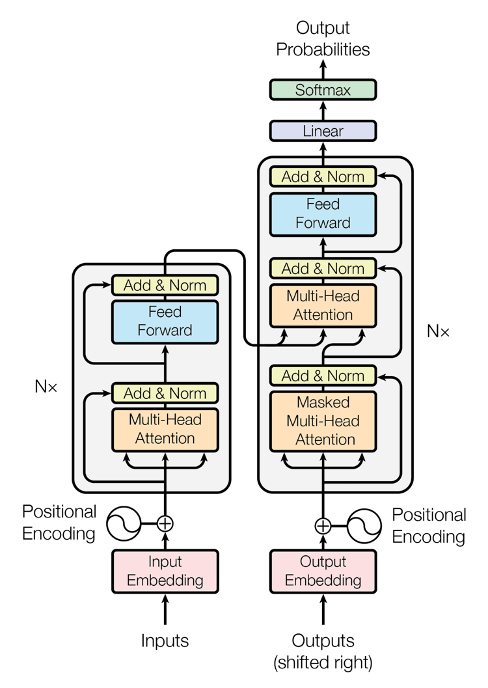

## Today the models face something messier {.smaller}

For three days our models ate **numbers** and **pixels**. Today: **human language**.

**NLP** (**Natural Language Processing**) = the field of AI that lets machines understand, process, and generate the languages humans actually speak.

. . .

Why is language HARD for machines? Because it's gloriously ambiguous:

::: {.incremental}
- *"I saw the man with the telescope."* , who has the telescope? 🔭
- In Arabic, **"عين"** can mean an eye, a water spring, or a spy , only context tells you which
- *"This phone is sick!"* , complaint or compliment? 🤒📱
:::

. . .

::: {.big .left style="font-size:0.95em"}
Humans resolve all of this instantly, using **context**. Today's whole story: how machines learned to do the same.
:::

# ✂️ Step 1: Chop it up {background-color="#eff6ff"}

## Tokenization {.smaller}

Computers can't swallow a whole sentence.

Step one of EVERY NLP system: split text into small units called **tokens**: words, or pieces of words.

> "The students love Majal initiative!" → [The] [students] [love] [Majal] [initiative] [!]

. . .

Try it , type anything, including Arabic 👇

<iframe src="widgets/tokenize.html" style="width:100%;height:290px;border:0;overflow:hidden" scrolling="no"></iframe>

## Cleaning up the tokens {.smaller}

Classic NLP systems then tidy up:

::: {.incremental}
- **Stopword removal**: drop super-common words ("the", "is", "of") that carry little meaning alone
- **Stemming**: chop endings with crude rules: running → run, studies → **studi** *(yes, sometimes it makes non-words , it's fast and dumb)*
- **Lemmatization**: the smart version: uses a dictionary to find the true root: better → good, was → be
:::

## Stemming vs lemmatization {background-color="#fafafa"}

::: {.sub style="text-align:left;margin:0 0 .3em"}
Click each word and watch where the crude chopper and the dictionary disagree. 👇
:::

<iframe src="widgets/stemlem.html" style="width:100%;height:310px;border:0;overflow:hidden" scrolling="no"></iframe>

# 🔢 Step 2: Words into numbers {background-color="#ecfdf5"}

## The first idea: just count {.smaller}

The golden rule of machine learning: models eat **numbers**, not words. History's first answer: **Bag of Words**.

The idea: throw all the words into a "bag," forget the order, and just **count how many times each word appears**. That count becomes the sentence's vector.

| Sentence | love | ai | hate | bugs |
|---|---|---|---|---|
| "I love love AI" | 2 | 1 | 0 | 0 |
| "I hate bugs" | 0 | 0 | 1 | 1 |

. . .

Works surprisingly well for spam detection. But it has **two serious problems**:

::: {.incremental}
- **It throws away word order**: because we only count words, *"the dog bit the man"* and *"the man bit the dog"* produce the exact SAME vector , even though they mean opposite things 🐕
- **It doesn't understand meaning**: each word is just a separate column, so "great" and "excellent" look as unrelated as "great" and "banana." The model has no idea they mean nearly the same thing 🍌
:::

## Word embeddings: give words a location {.smaller}

The breakthrough: represent each word as a **vector**: coordinates on a map , learned so that **similar meanings sit close together**.

{fig-align="center" height="360"}

::: {.sub}
Learned automatically from millions of sentences, with one unsupervised signal: *words appearing in similar contexts probably mean similar things.* (The unsupervised idea, applied to language!)
:::

## Explore the map yourself {background-color="#fafafa"}

::: {.sub style="text-align:left;margin:0 0 .3em"}
Click any word to light up its neighbors, then try **Word arithmetic**: king − man + woman. 👇
:::

<iframe src="widgets/embed_map.html" style="width:100%;height:520px;border:0;overflow:hidden" scrolling="no"></iframe>

## What you just saw {.smaller}

::: {.incremental}
- "cat" lives next to "kitten" and "dog" . **meaning became geometry**
- The map encodes **relationships**: the direction man→woman equals the direction king→queen
- **king − man + woman ≈ queen**: the map learned the *concept of gender*. Nobody programmed it. 🤯
:::

## {.smaller .quiz-slide}

[?]{.quiz-mark}

Which word should be closer to "doctor": "hospital" or "guitar"?

Why did training put them there, with no human labeling anything?

::: {.quiz-footer}
Pause & discuss with a partner
:::

# 🏦 Step 3: The context problem {background-color="#fdf4ff"}

## One word, one vector… forever? {.smaller}

Word embeddings had one big weakness: each word gets exactly **ONE vector**, no matter the sentence.

{fig-align="center" height="300"}

::: {.incremental}
- *"I deposited money in the **bank**."* 🏦
- *"We had a picnic on the river **bank**."* 🏞️
- Same word, totally different meanings , and a classic embedding gives it the **same vector in both.** The model is blind to context.
:::

## Contextual embeddings {.smaller}

Models like **BERT** (2018) fixed it: the vector for a word is computed **fresh, from the sentence around it.**

::: {.incremental}
- "bank" near "money" → a finance-flavored vector 💰
- "bank" near "river" → a nature-flavored vector 🌊
:::

. . .

But computing context-aware vectors means the model must actually **look at the other words**.

::: {.big style="font-size:1em"}
HOW it looks is the single most important idea of the decade.
:::

## Two sentences of history {.smaller}

Before 2017, language models (**RNNs**, **LSTMs**) read text **one word at a time**, left to right, carrying a "memory" that faded fast , by the end of a long paragraph they'd forgotten the beginning. And word-by-word reading made them painfully **slow to train**.

. . .

In 2017, a paper with the perfect title . ***"Attention Is All You Need"*** , replaced them.

::: {.sub}
Everything you've heard of since . ChatGPT, Claude, Gemini , descends from it.
:::

# 👁️ Attention {background-color="#fff7ed"}

## Answer honestly {.smaller}

::: {.big .left style="font-size:1em"}
"The trophy didn't fit in the suitcase because **it** was too big."
:::

What does **"it"** refer to?

. . .

You instantly knew: **the trophy**. Now change ONE word:

::: {.big .left style="font-size:1em"}
"The trophy didn't fit in the suitcase because **it** was too **small**."
:::

. . .

Suddenly "it" means **the suitcase**!

::: {.big style="font-size:0.95em"}
Your brain resolved this by weighing every word against every other word. **Attention is exactly that , as math.**
:::

## Watch attention decide {background-color="#fafafa"}

Click any word to see where its attention flows (arc thickness = weight). Then flip BIG → SMALL and watch "it" change its mind. The bank sentences show context being solved live. 👇

<iframe src="widgets/attention.html" style="width:100%;height:420px;border:0;overflow:hidden" scrolling="no"></iframe>

::: {.sub style="font-size:0.6em"}
Weights illustrative, shaped like what trained models learn , you'll compute real ones in Lab 2.
:::

## This is what it looks like in a real model {.smaller}

{fig-align="center" height="440"}

::: {.sub}
A real attention matrix: every row = one token's attention over all the others. Look at the bright cells , the model found "the ↔ cat", "chased ↔ mouse" by itself.
:::

## Why attention changed everything {.smaller}

For every token, the model computes:

::: {.big .left style="font-size:0.95em"}
*"how relevant is every other token to understanding ME?"*
:::

Three revolutionary consequences:

::: {.incremental}
- **Context becomes automatic**: the "bank" problem is solved: a word's meaning is assembled from what it attends to
- **No forgetting**: word 1 and word 1000 connect **directly**, no fading memory chain
- **Parallel processing**: all words processed at once, not one-by-one. THIS is what made training on the entire internet possible ⚡
:::

## {.smaller .quiz-slide}

[?]{.quiz-mark}

"The doctor called the patient because she was worried about the results."

Which words should "she" attend to most strongly? Is the sentence even resolvable? What does that tell you about language?

::: {.quiz-footer}
Pause & discuss with a partner
:::

# 🏗️ The Transformer {background-color="#f5f3ff"}

## Attention, stacked {.smaller}

::: {.text-fig}
::: {.tf-text}
The **Transformer** = the architecture built around attention: layers of attention + small neural networks, **stacked deep**.

::: {.incremental}
- Same story as CNNs in computer vision: **deeper layers learn more abstract things**
- Early layers catch **grammar**; deep layers catch **meaning, tone, intent**
- Two halves in the original:
  - **Encoder** (reads . BERT descends from it)
  - **Decoder** (generates, word by word . GPT descends from it)
:::

::: {.big .left style="font-size:0.9em;margin-top:.6em"}
Modern chatbots . ChatGPT, Claude , are giant stacks of Transformer **decoder** layers.
:::
:::

::: {.tf-img}

:::
:::

# 🤖 LLMs {background-color="#ecfdf5"}

## Ready for the secret? {.smaller}

A **Large Language Model** is trained on exactly ONE task:

::: {.big}
Predict the next token.
:::

. . .

That's it. Show it *"The capital of Saudi Arabia is ___"*, train it to say *"Riyadh"*. Do this on **trillions of tokens** with **billions of weights**, and something remarkable happens:

::: {.incremental}
- to get good at predicting the next word, the model is FORCED to learn grammar, facts, reasoning patterns, coding styles, and dozens of languages 
- because **all of that helps prediction.**
:::

## Control how creative it is {background-color="#fafafa"}

The model scores every possible next token. **Temperature** controls how adventurously it picks.

::: {.sub style="text-align:left;margin:.2em 0 .3em"}
**Low temperature** = strict and safe: it almost always grabs the single most likely word. **High temperature** = creative and adventurous: it takes chances on less likely words. Drag it to the extremes and sample 50 times. 👇
:::

<iframe src="widgets/nexttoken.html" style="width:100%;height:540px;border:0;overflow:hidden" scrolling="no"></iframe>

## Two consequences you'll verify today {.smaller}

**Temperature** 🌡️

::: {.incremental}
- **Low** = always take the top choice (consistent, boring)
- **High** = sample freely (creative, chaotic)
- You just felt it.
:::

. . .

**Hallucination** 👻

::: {.incremental}
- The model only ever tries to write the most **plausible-sounding** next words , it has no separate check for whether they're **true**
- So it can hand you a completely wrong answer while sounding totally sure of itself. It's not "unsure and guessing" , it sounds just as confident as when it's right
- That confident tone is NOT evidence it's correct. Always verify facts yourself.
:::

## {.smaller .quiz-slide}

[?]{.quiz-mark}

An LLM confidently gives you a fake reference to a research paper that doesn't exist , authors, title, year, all invented.

Using "predict the plausible next token," explain why this happens. Is the model lying?

::: {.quiz-footer}
Pause & discuss with a partner
:::

## From autocomplete to assistant {.smaller}

Raw next-token prediction gives you a wild autocomplete , not a helpful assistant. Three stages close the gap:

| Stage | What happens | Analogy |
|---|---|---|
| **Pretraining** | Next-token prediction on massive internet text | Reading every book in the library 📚 |
| **Fine-tuning** | Further training on examples of following instructions helpfully & safely | Job training for being an assistant 💼 |
| **System prompt** | Hidden instructions set behavior at RUN time , no training at all | A sticky note on the desk: *"be formal, answer in Arabic"* 📝 |

::: {.sub}
Today you'll change a model's entire personality with one sentence.
:::

## What an LLM still cannot do {.smaller}

After today, you understand what's inside the box. But try asking the box:

::: {.incremental}
- 🌦️ *"What's the weather in Khobar right now?"* , knowledge **froze** at training time
- 🧮 *"What is 847,293 × 652?"* , it will guess plausible-looking digits, often wrong
- 📧 *"Send this report to my manager."* , it can write the email; it has **no hands** to send it
:::

. . .

::: {.big .left style="font-size:0.95em"}
A brain with no eyes, no calculator, no hands. **Giving it all three is next.** That's Agentic AI, the frontier. 🚀
:::

# 🛠️ What you'll build {background-color="#f8fafc"}

## Three labs {.smaller}

::: {.incremental}
- **Lab 1 . The Language Detective** 🔍 
  Tokenize, clean, and count text , the classic NLP pipeline, hands-on.
- **Lab 2 . The Meaning Machine** 🗺️ 
  Play with REAL word embeddings (king − man + woman = ?), watch contextual embeddings split the two meanings of "bank", and build your own semantic search engine.
- **Lab 3 . Talk to the Machine** 💬 
  Your first LLM API calls: change a model's personality with a system prompt, break it with temperature, and master the prompting techniques that make it useful.
:::

. . .

::: {.big}
From counting words to ChatGPT , in one day. Let's go. 🚀
:::
